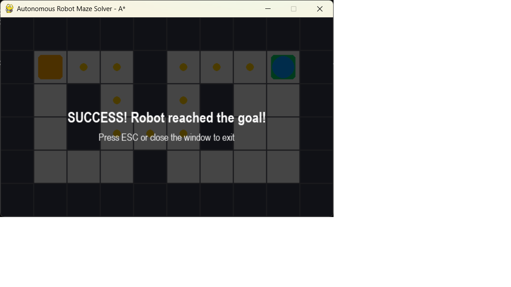

<div align="center">

# 🤖 Autonomous Robot Maze Solver using A* Path Planning

### A Python + Pygame simulation where a robot thinks for itself — finding and following the shortest path through a maze, all on its own.


</div>

---

## 📸 Demo

<!-- Replace this line once you upload your screenshot/GIF to the screenshots/ folder -->


> *Add a screenshot or short GIF of the robot solving the maze here — it's the first thing visitors see!*

---

## 📖 Table of Contents

- [About the Project](#-about-the-project)
- [How It Works](#-how-it-works)
- [The A* Algorithm](#-the-a-algorithm-explained-simply)
- [Tech Stack](#-tech-stack)
- [Project Structure](#-project-structure)
- [Installation](#-installation)
- [Usage](#-usage)
- [Customizing the Maze](#-customizing-the-maze)
- [Future Improvements](#-future-improvements)
- [License](#-license)
- [Author](#-author)

---

## 🎯 About the Project

Imagine a robot dropped into a maze with no map and no help. This project simulates exactly that — entirely in code, with **no physical robot required**.

The robot automatically:
- 🔍 **Finds** the shortest route to the goal
- 🚧 **Avoids** every wall in its path
- 🧠 **Calculates** the optimal path *before* moving — not by trial and error
- 🎯 **Reaches** the destination completely on its own

This is a hands-on demonstration of **path planning**, a core concept in robotics, self-driving cars, warehouse automation, and game AI.

---

## ⚙️ How It Works

```
Start Program
      ↓
  Load Maze            → maze.py reads the grid and locates Start (S) and Goal (G)
      ↓
  Show Robot           → robot.py places the robot on its starting cell
      ↓
Calculate Best Path     → astar.py runs the A* algorithm to find the shortest route
      ↓
Move Step by Step       → the robot animates smoothly across the grid, cell by cell
      ↓
 Reached Goal?
      ↓
     Yes
      ↓
Show Success Message    → a "Success!" overlay confirms the robot arrived
```

---

## 🧠 The A* Algorithm, Explained Simply

Picture yourself in a maze, and at every junction someone tells you *roughly* how far away the exit is. You'd naturally head toward the path that keeps shrinking that number, instead of wandering randomly.

That's exactly what **A\*** does. For every possible next step, it combines two numbers:

| Term | Meaning |
|------|---------|
| **g(n)** | Steps already taken to reach this cell |
| **h(n)** | Estimated steps remaining to the goal (straight-line grid distance) |
| **f(n) = g(n) + h(n)** | Total estimated cost of a path through this cell |

A* always explores the cell with the **lowest f(n)** first. This means it finds the shortest path *and* does it efficiently, without wastefully exploring every dead end — exactly why it's the industry-standard algorithm for real-world navigation and game AI.

---

## 🛠️ Tech Stack

| Technology | Purpose |
|------------|---------|
| **Python** | Core programming language |
| **Pygame (pygame-ce)** | Renders the maze and animates the robot |
| **VS Code** | Development environment |
| **Git & GitHub** | Version control and project hosting |

---

## 📂 Project Structure

```
Robot-Maze-Solver/
│
├── main.py             # Entry point — runs the simulation loop
├── maze.py              # Maze class — loads and parses the grid
├── robot.py              # Robot class — position, movement, drawing
├── astar.py              # A* pathfinding algorithm
├── utils.py              # Shared constants and helper functions
│
├── assets/
│   └── robot.png          # (optional) custom robot sprite
│
├── screenshots/           # Demo images/GIFs for this README
│
├── README.md
├── requirements.txt
└── LICENSE
```

---

## 💻 Installation

**1. Clone this repository**
```bash
git clone https://github.com/YOUR-USERNAME/robot-maze-solver-astar.git
cd robot-maze-solver-astar
```

**2. Install the dependency**
```bash
pip install -r requirements.txt
```

> This project uses **pygame-ce** (Community Edition) — a drop-in replacement for `pygame` with the same API, but with prebuilt wheels for the latest Python versions.

---

## ▶️ Usage

Run the simulation:
```bash
python main.py
```

A window opens showing:
- 🟧 **Orange square** — Start position
- 🟩 **Green square** — Goal
- 🔵 **Blue circle** — The robot, moving automatically along the shortest path
- 🟡 **Yellow trail** — Cells the robot has already visited

Press **ESC** or close the window to exit.

---

## 🧩 Customizing the Maze

Open `maze.py` and edit `DEFAULT_MAZE_LAYOUT` — it's just a list of equal-length strings:

```python
DEFAULT_MAZE_LAYOUT = [
    "##########",
    "#S..#...G#",
    "#.#.#.#..#",
    "#.#...#..#",
    "#...#....#",
    "##########",
]
```

- `#` = wall
- `.` = open path
- `S` = start (exactly one required)
- `G` = goal (exactly one required)

Make it bigger, add more walls, or design your own maze — the algorithm adapts automatically.

---

## 🚀 Future Improvements

- [ ] Add a maze generator for random mazes every run
- [ ] Add multiple robots racing to the same goal
- [ ] Add diagonal movement support
- [ ] Add a speed slider / step-by-step manual mode
- [ ] Visualize the algorithm's search process (explored cells) in real time

---

## 📄 License

This project is licensed under the **MIT License** — see the [LICENSE](LICENSE) file for details.

---

## 👤 Author

**Prajyuth-G**
🔗 [GitHub](https://github.com/Prajyuth-G) • 📧 23pa1a0445@vishnu.edu.in

---

<div align="center">

If you found this project interesting, consider giving it a ⭐ on GitHub!

</div>
